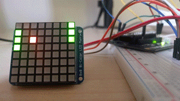

# MicroPython BiColor 8x8 Matrix Driver

This is a micropython driver for the [Adafruit BiColor 8x8 LED Matrix I2C backpack](https://www.adafruit.com/product/902).



Thank you to the [official C driver](https://github.com/adafruit/Adafruit_Python_LED_Backpack) and [Jan Bednarik's driver for the monochrome matrix](https://github.com/JanBednarik/micropython-matrix8x8), which were used as references.

## Installation

Copy [`bicolor8x8.py`](bicolor8x8.py) to your project.

## Wiring

The I2C backpack should be wired to your board's ground, 3V3, SDA and SDL pins. See the [LoPy](https://docs.pycom.io/chapter/datasheets/downloads/lopy-pinout.pdf), [LoPy 4](https://docs.pycom.io/chapter/datasheets/downloads/lopy4-pinout.pdf) and [WiPy 3](https://docs.pycom.io/chapter/datasheets/downloads/wipy3-pinout.pdf) pinouts for the default pins.

## Usage

```python
from bicolor8x8 import BiColor8x8, RED, GREEN, YELLOW

matrix = BiColor8x8()

# Turn the matrix red
for x in range(8):
  for y in range(8):
    matrix[x, y] = RED

# Draw the buffer to the matrix
matrix.draw()
```

The SDA and SDL pins can be changed to any general-purpose pins by passing in a custom I2C object.

```python
i2c = I2C(0, I2C.MASTER, BiColor8x8.BAUDRATE)
matrix = BiColor8x8(i2c)
```
